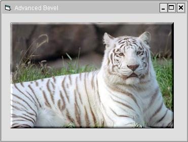

<div align="center">

## Advanced Bevel \(Paintshop\-like filter\)


</div>

### Description

This is an advanced bevel that has the look of paintshop's bevel filter. Very smooth, see screenshot. Please vote/leave comments.
 
### More Info
 


<span>             |<span>
---                |---
**Submitted On**   |
**By**             |[KRYO\_11](https://github.com/Planet-Source-Code/PSCIndex/blob/master/ByAuthor/kryo-11.md)
**Level**          |Intermediate
**User Rating**    |5.0 (10 globes from 2 users)
**Compatibility**  |VB 5\.0, VB 6\.0
**Category**       |[Graphics](https://github.com/Planet-Source-Code/PSCIndex/blob/master/ByCategory/graphics__1-46.md)
**World**          |[Visual Basic](https://github.com/Planet-Source-Code/PSCIndex/blob/master/ByWorld/visual-basic.md)
**Archive File**   |[](https://github.com/Planet-Source-Code/kryo-11-advanced-bevel-paintshop-like-filter__1-54285/archive/master.zip)

### API Declarations

```
Private Declare Function GetPixel Lib "gdi32" (ByVal hDC As Long, ByVal X As Long, ByVal Y As Long) As Long
Private Declare Function SetPixel Lib "gdi32" (ByVal hDC As Long, ByVal X As Long, ByVal Y As Long, ByVal crColor As Long) As Long
Private Declare Function TranslateColor Lib "olepro32.dll" Alias "OleTranslateColor" (ByVal clr As OLE_COLOR, ByVal palet As Long, Col As Long) As Long
```


### Source Code

```
Public Sub Bevel(ByVal hDC As Long, ByVal X1 As Long, ByVal Y1 As Long, ByVal X2 As Long, ByVal Y2 As Long, ByVal Thickness As Integer, Optional OuterBevel As Boolean = True)
  Dim dCol As Long
  Dim i As Long, j As Long, R As Long
  Dim vAdj As Integer, lFactor As Integer
  Dim Step As Single
  Dim OffSet As Integer
  'Ensure thickness is between 1 and 100
  Thickness = SetBound(Thickness, 1, 100)
  'if it is an inner bevel the factor and step need to be reversed
  If OuterBevel Then
    lFactor = 125
    Step = 125 / Thickness
  Else
    lFactor = -125
    Step = -(125 / Thickness)
  End If
  'this draws the horizontal shadow/highlight from left to right
  For i = X1 To X2
    vAdj = 0
    For j = 1 To Thickness
      'this IF statement ensure the bevels do not overlap
      If i - X1 >= vAdj And i - X1 <= X2 - vAdj Then
        'get the pixel color for the top and lighten/darken it
        dCol = AdjustBrightness(GetPixel(hDC, i, Y1 + j - 1), lFactor - (vAdj * Step))
        SetPixel hDC, i, Y1 + j - 1, dCol
        'get the pixel color for the bottom and lighten/darken it
        dCol = AdjustBrightness(GetPixel(hDC, i, Y2 - j), -lFactor + (vAdj * Step))
        SetPixel hDC, i, Y2 - j, dCol
      End If
      vAdj = vAdj + 1
    Next j
  Next i
  'this draws the verticle shadow/highlight from top to bottom
  For i = Y1 To Y2
    vAdj = 0
    For j = 1 To Thickness
      'this IF statement ensure the bevels do not overlap
      If i - Y1 >= vAdj And i - Y1 <= Y2 - vAdj Then
        'get the pixel color for the left and lighten/darken it
        dCol = AdjustBrightness(GetPixel(hDC, X1 + j - 1, i), lFactor - (vAdj * Step))
        SetPixel hDC, X1 + j - 1, i, dCol
        'get the pixel color for the right and lighten/darken it
        dCol = AdjustBrightness(GetPixel(hDC, X2 - j, i), -lFactor + (vAdj * Step))
        SetPixel hDC, X2 - j, i, dCol
      End If
      vAdj = vAdj + 1
    Next j
  Next i
End Sub
Private Function SetBound(ByVal Num As Single, ByVal MinNum As Single, ByVal MaxNum As Single) As Single
  'this is to support the above functions
  'makes sure a number is between certain values
  If Num < MinNum Then
    SetBound = MinNum
  ElseIf Num > MaxNum Then
    SetBound = MaxNum
  Else
    SetBound = Num
  End If
End Function
Public Function AdjustBrightness(ByVal Color As Long, ByVal Amount As Single) As Long
  On Error Resume Next
  'lightens/darken a color
  Dim R(1) As Integer, G(1) As Integer, B(1) As Integer
  GetRGB R(0), G(0), B(0), Color
  R(1) = SetBound(R(0) + Amount, 0, 255)
  G(1) = SetBound(G(0) + Amount, 0, 255)
  B(1) = SetBound(B(0) + Amount, 0, 255)
  AdjustBrightness = RGB(R(1), G(1), B(1))
End Function
Public Sub GetRGB(R As Integer, G As Integer, B As Integer, ByVal Color As Long)
  Dim TempValue As Long
  TranslateColor Color, 0, TempValue
  'get the red, green, and blue values
  If Color Then
    R = Color And &HFF&
    G = Color \ 256 And &HFF
    B = Color \ 65536
  Else
    R = 0
    G = 0
    B = 0
  End If
End Sub
```

